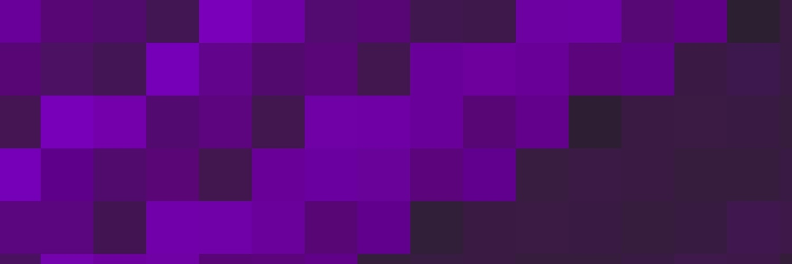

# Hi, I'm Rezzie 👋🏽☺️ (she/her)

I'm a Senior Software Engineer with 7+ years building WordPress platforms, internal tooling, and full-stack web applications. 
Based in Trinidad & Tobago 🇹🇹


## I'm currently ...

```text
🔭 Building CubePB — a Rubik's cube solve logger built with Deno, Hono and Supabase
🌱 Deepening my knowledge in Go and Deno
📖 Open to new opportunities
```

## Featured Projects
- **[brutils](https://github.com/rezziemaven/brutils):** CLI tooling for Docker-based WordPress development with Roots Bedrock configurations
- **[WP Templates](https://github.com/rezziemaven/wp-template):** CLI tooling for adding a simple README.md, .gitignore and composer.json to your custom WordPress theme or plugin
- **[Versus BE](https://github.com/rezziemaven/versus-be):** Sports ranking API for the [Versus](https://github.com/OliWalker/versus-fe) platform with ELO-based leaderboards

## Where to reach me
- [LinkedIn](https://linkedin.com/in/sherezz)

---

Original photo by [Logan Voss](https://unsplash.com/@loganvoss?utm_source=unsplash&utm_medium=referral&utm_content=creditCopyText) on [Unsplash](https://unsplash.com/photos/abstract-purple-streaks-on-a-dark-background-AU4FwPrtXHA?utm_source=unsplash&utm_medium=referral&utm_content=creditCopyText)
      

<!--
**rezziemaven/rezziemaven** is a ✨ _special_ ✨ repository because its `README.md` (this file) appears on your GitHub profile.

Here are some ideas to get you started:

- 🔭 I’m currently working on ...
- 🌱 I’m currently learning ...
- 👯 I’m looking to collaborate on ...
- 🤔 I’m looking for help with ...
- 💬 Ask me about ...
- 📫 How to reach me: ...
- 😄 Pronouns: ...
- ⚡ Fun fact: ...
-->
